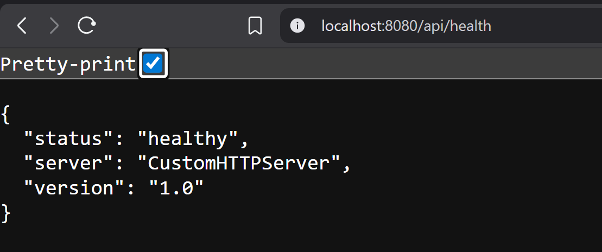
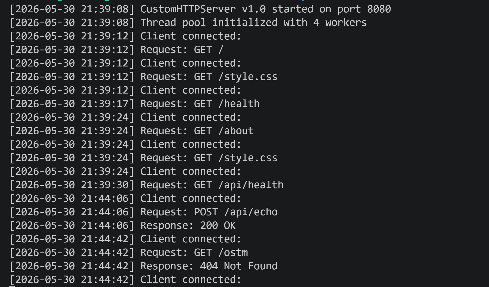

# Multithreaded HTTP Server

A custom HTTP/1.1 server built from scratch in C++ using TCP socket programming. The server supports request parsing, route handling, static file serving, JSON API endpoints, structured logging, and thread-pool based concurrency.

## Features

* HTTP/1.1 Request Parsing
* Static File Serving (HTML, CSS)
* Route Handling
* MIME Type Detection
* JSON API Endpoints
* Structured Logging
* Thread Pool Based Concurrency
* Modular Architecture
* 400 Bad Request Handling
* Content-Length Header Support

## Tech Stack

* C++
* POSIX Sockets
* Multithreading (`std::thread`)
* Mutexes
* Condition Variables
* File I/O
* Linux (WSL Ubuntu)

## Architecture

The main server thread accepts incoming client connections and pushes them into a synchronized task queue. A fixed-size thread pool consumes tasks from the queue and processes HTTP requests concurrently. The server supports request parsing, route handling, static file serving, MIME-type detection, structured logging, and JSON API responses.

## Project Structure

```text
custom-http-server/
│
├── include/
│   ├── Logger.h
│   ├── FileUtils.h
│   └── RequestHandler.h
│
├── src/
│   ├── main.cpp
│   ├── Logger.cpp
│   ├── FileUtils.cpp
│   └── RequestHandler.cpp
│
├── static/
│   ├── index.html
│   ├── about.html
│   └── style.css
│
├── screenshots/
│
└── README.md
```

## Supported Routes

| Route       | Method | Description             |
| ----------- | ------ | ----------------------- |
| /           | GET    | Home Page               |
| /about      | GET    | About Page              |
| /health     | GET    | Plain Text Health Check |
| /api/health | GET    | JSON Health Check       |
| /api/echo   | POST   | Echo Request Body       |

## Build

```bash
g++ src/main.cpp \
    src/Logger.cpp \
    src/FileUtils.cpp \
    src/RequestHandler.cpp \
    -o build/server \
    -pthread
```

## Run

```bash
./build/server
```

Open:

```text
http://localhost:8080
```

## Concepts Demonstrated

* Socket Programming
* HTTP Protocol
* Request Parsing
* Thread Pools
* Synchronization
* Concurrent Client Handling
* Static File Serving
* Backend Architecture
* Structured Logging

## Future Improvements

* Configuration Files
* Persistent Connections
* Unit Testing
* HTTPS Support
* Image Serving


## Screenshots

### Home Page


### API Response



### Server Logs

